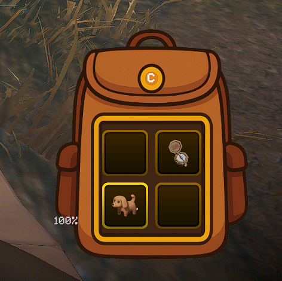
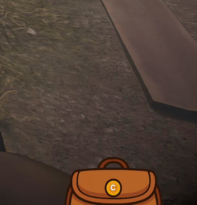
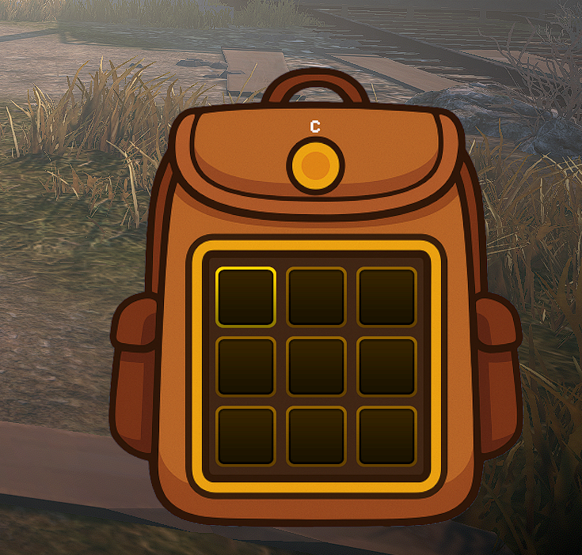
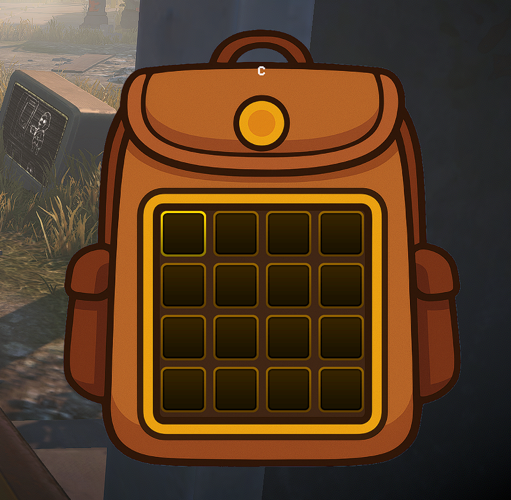
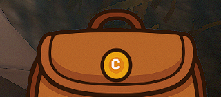

# MIMESIS - InventoryExpansion

> 🛟 **Need help or found a bug?** Get support at [support.doodesch.de/inventoryexpansion](https://support.doodesch.de/inventoryexpansion).


> Adds extra backpack inventory slots you toggle on demand with a configurable key, shown in a custom animated panel that slides in and out.
> Carry more loot without permanently cluttering the standard 4-slot hotbar. Standalone, no MimicAPI required.


## Features

- Adds 4, 9, or 16 extra inventory slots laid out as a square grid (2x2, 3x3, or 4x4); the count is configurable. The new slots are real, usable inventory, not just a visual overlay.
- Toggle between the standard hotbar and the backpack with a configurable key (default `C`); the mod reads the key live each frame.
- Extra slots render in a custom backpack UI panel that uses the shipped `Backpack.png` sprite and slides in and out with a short eased animation. If the image is missing it falls back to a translucent black panel.
- Shows a visual key hint on the panel displaying the currently configured toggle key.
- Context-aware slot scrolling: while the backpack is open, slot cycling affects only the backpack slots; while it is closed, it affects only the standard 4 slots.
- Cursor handoff on toggle: opening the backpack moves your selection to the first backpack slot, and closing it returns the selection to the standard inventory, so the cursor never stays stuck on a hidden slot. Each direction is configurable.
- Optional backpack-first pickup: while the backpack is open, items you pick up fill the backpack slots before the standard inventory (host / single-player only).
- Optional movement-speed reduction to 50% while the backpack is fully open, restored automatically when it closes.
- Automatically hides the panel during loading screens and map changes, and when you leave the game or return to the title screen.

## Screenshots

<table align="center">
  <tr>
    <td align="center" width="50%">
      <br>
      <sub><b>Open with loot</b> - the extra slots hold real items</sub>
    </td>
    <td align="center" width="50%">
      <br>
      <sub><b>Toggle with a key</b> (default <code>C</code>)</sub>
    </td>
  </tr>
</table>

<table align="center">
  <tr>
    <td align="center" width="33%">
      <br>
      <sub>9 slots (3x3)</sub>
    </td>
    <td align="center" width="33%">
      <br>
      <sub>16 slots (4x4)</sub>
    </td>
    <td align="center" width="33%">
      <br>
      <sub>Resting peek</sub>
    </td>
  </tr>
</table>

## Requirements

| Component | Version |
|-----------|---------|
| MIMESIS | 0.3.0 (current Steam build) |
| MelonLoader | 0.7.3+ |

## Installation

### Recommended: Thunderstore mod manager

Install through a Thunderstore mod manager such as [r2modman](https://thunderstore.io/package/ebkr/r2modman/) or [Gale](https://thunderstore.io/package/Kesomannen/GaleModManager/). It resolves the MelonLoader dependency and ships the backpack asset automatically.

### Manual

1. Install [MelonLoader 0.7.3](https://melonwiki.xyz/#/) into MIMESIS.
2. Download the latest release from the [releases page](../../releases).
3. Place `InventoryExpansion.dll` into `MIMESIS/Mods/`.
4. Place the bundled `Backpack.png` at `MIMESIS/Mods/Assets/Backpack.png` (an `Assets` subfolder next to the DLL). Without it the panel still works but renders as a plain translucent box.
5. Launch the game once to generate the configuration file at `UserData/MelonPreferences.cfg`.

## Configuration

Stored in `UserData/MelonPreferences.cfg` under the `[InventoryExpansion]` category. You can also edit these through a MelonPreferences UI.

| Option | Description | Default | Values/Range |
|--------|-------------|---------|--------------|
| `Enabled` | Enable InventoryExpansion functionality. When disabled, the mod will not modify game behavior. | `true` | `true` / `false` |
| `AdditionalSlots` | Number of extra inventory slots to add on top of the game's default inventory size. Valid values: 4, 9, or 16 (square grids 2x2, 3x3, 4x4). Other values are rounded to the nearest valid option. | `4` | `4`, `9`, or `16` (clamped at read time: `<=6` becomes `4`, `<=12` becomes `9`, otherwise `16`; the corrected value is written back to the config) |
| `BackpackKey` | Key to toggle backpack visibility. Press to switch between standard inventory and backpack. | `C` | Any `UnityEngine.KeyCode` name (parsed case-insensitively). Invalid or empty values fall back to `C`. The key must also be a valid Unity Input System key name for the toggle to fire. |
| `ReduceMovementSpeed` | When enabled, player movement speed is reduced to 50% while the backpack is fully open. | `true` | `true` / `false` |
| `SelectBackpackSlotOnOpen` | When opening the backpack, move the selected slot to the first backpack slot. | `true` | `true` / `false` |
| `RestoreStandardSlotOnClose` | When closing the backpack, return the selected slot to the standard inventory (the slot selected before opening). | `true` | `true` / `false` |
| `FillBackpackFirst` | While the backpack is open, picked-up items fill the backpack slots before the standard inventory. Host / single-player only. | `true` | `true` / `false` |

## Usage

- Press the configured toggle key (default `C`) to slide the backpack panel in and out. The panel sits at the bottom-right of the screen and shows a key hint.
- When the backpack is open, slot scrolling and selection cycle only the backpack slots; when it is closed, they cycle only the standard 4 hotbar slots.
- Opening the backpack jumps your selection to the first backpack slot; closing it returns the selection to your previous standard slot, so the cursor is never stuck on a hidden slot (toggle each via `SelectBackpackSlotOnOpen` / `RestoreStandardSlotOnClose`).
- With `FillBackpackFirst` on, items you pick up while the backpack is open go into backpack slots first. This changes server-side placement, so it only applies when you host or play single-player.
- With `ReduceMovementSpeed` on, you move at 50% speed while the backpack is fully open, and full speed is restored when it closes.
- The panel auto-hides during loading screens and map changes, and when you leave the game or return to the title screen.
- Set `AdditionalSlots` (4, 9, or 16) and `BackpackKey` in `UserData/MelonPreferences.cfg`; the mod reads the key live each frame.

## Compatibility

Built for Mimesis 0.3.0 / MelonLoader 0.7.3. This is a client-side, single-player UI mod with no host or multiplayer requirement.

## Building (developers)

```
dotnet build -c Release
```

References are resolved from `Workspace/lib/game` (game DLLs) and `Workspace/lib/melonloader`. The PostBuild step copies `InventoryExpansion.dll` to the configured `Mods` directory and copies `Assets/Backpack.png` to `Mods/Assets/Backpack.png`.

## Credits / License

Author: DooDesch. Provided as-is under the MIT License. Contributions welcome via pull requests on the [repository](https://github.com/DooDesch/Mimesis-InventoryExpansion).

## AI disclosure

The mod icon is AI-generated. Code and configuration are hand-written.
